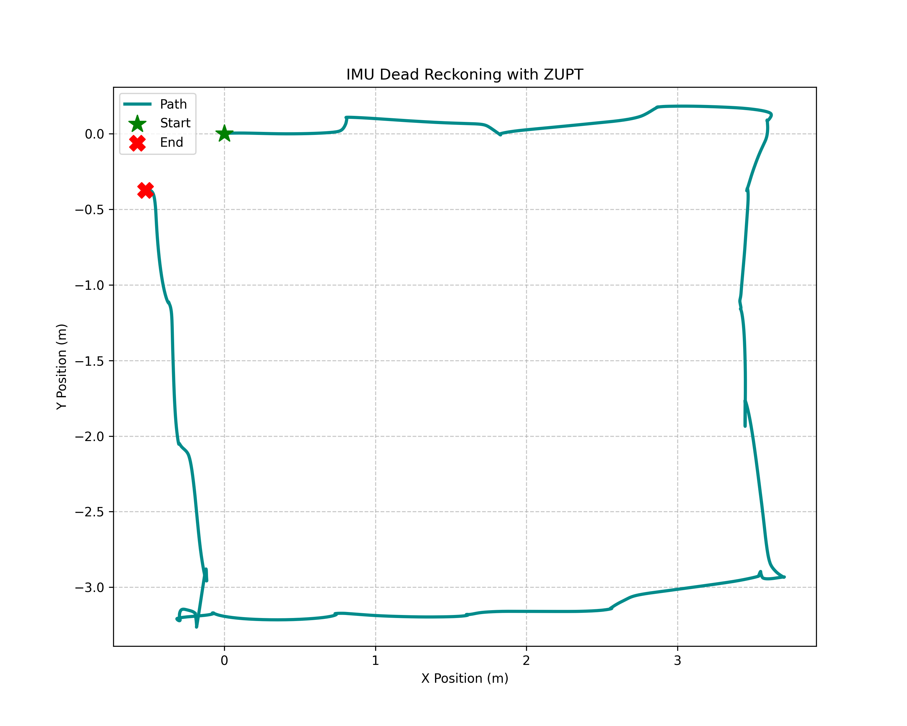
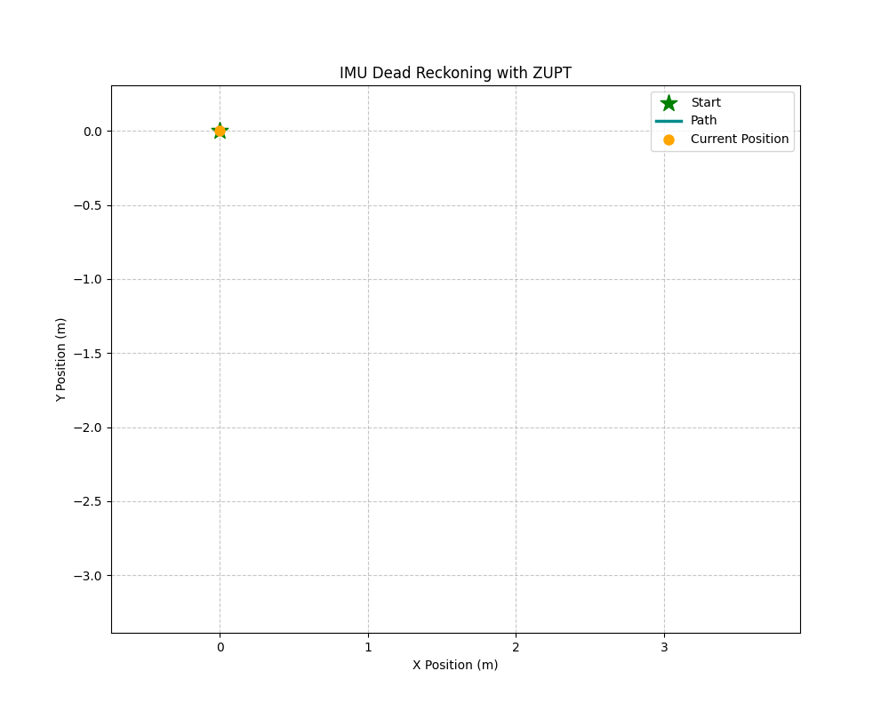
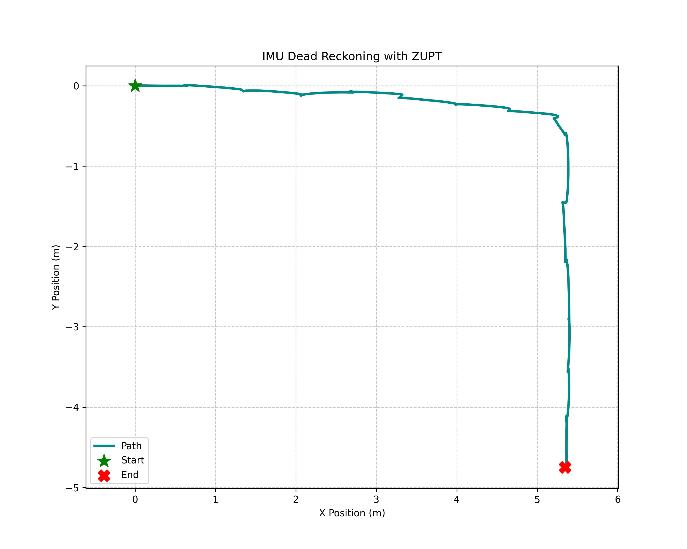
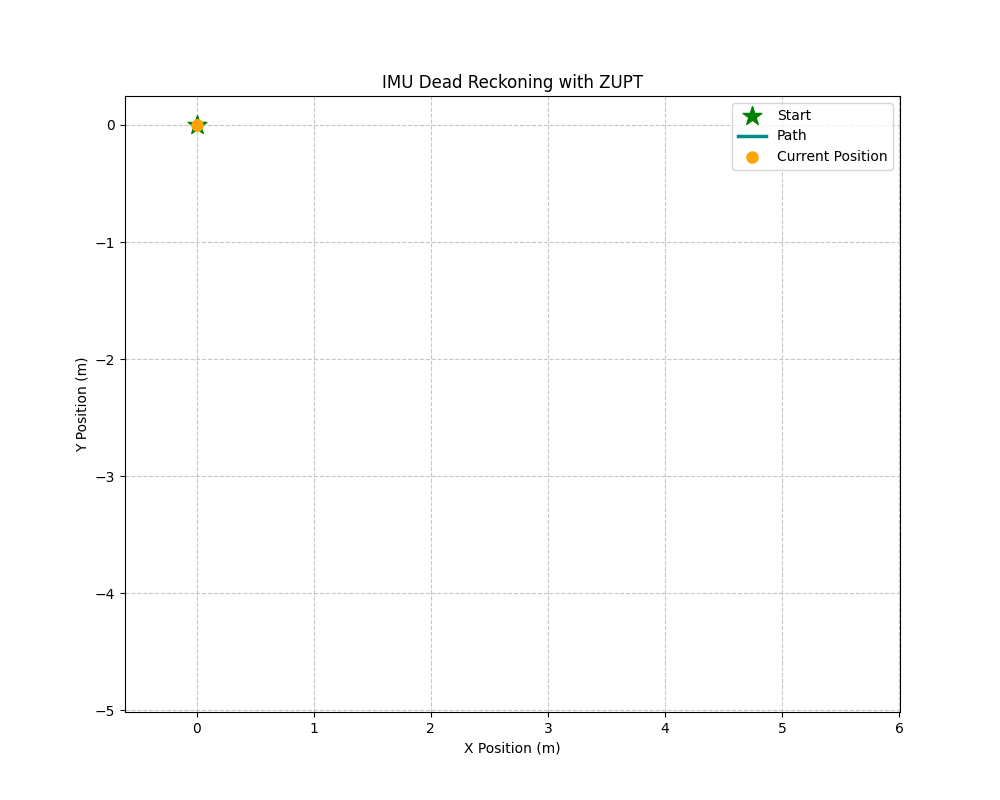
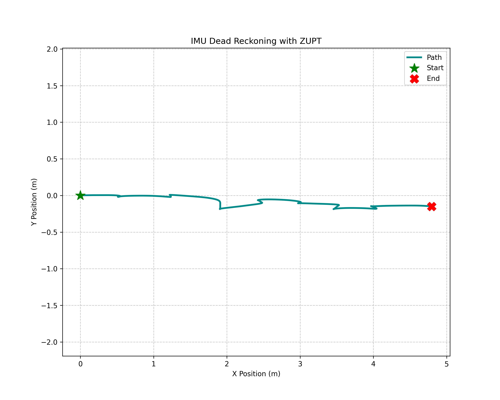
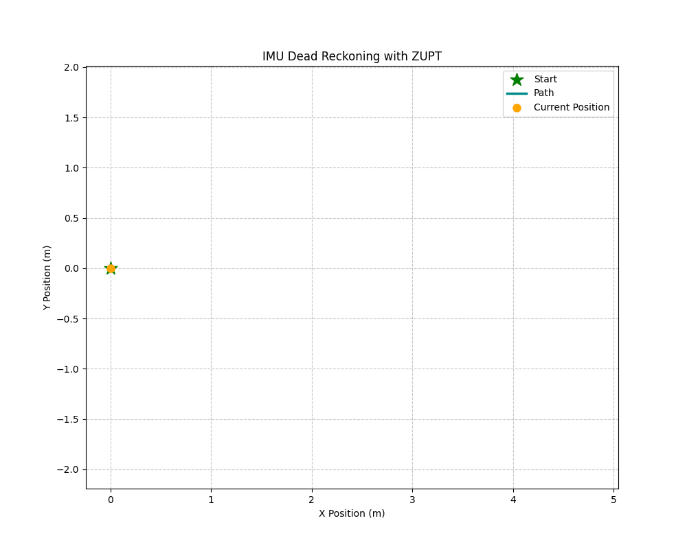

# EECS 568 Final Project - Indoor Localization via IMU Dead Reckoning and ZUPT 

## Project Overview
This project implements an indoor localization system using a foot-mounted 9-DoF IMU (ICM-20948) and an ESP32 microcontroller. The system addresses the  challenge of IMU drift and inaccuracies in an environment when GPS is not avaliable by utilizing an Right Invariant Extended Kalman Filter (RIEKF) and a soft Zero-Velocity Updates (ZUPT) to reconstruct accurate 2D trajectories from raw IMU data.

### Results
Below are the reconstructed 2D trajectory graphs after performing dead-reckoning in various scenarios, namely walking in a sqaure, a straight line, and a line with a sharp right turn. The perspective is from the user (i.e. walking forward is illustrated as positive x, etc).

To capture the data, we soldered a ESP32 and a 9-DoF IMU onto a proto board, along with a 3.3V buck converter to power the device and peripherals. A 3.7V LiPO battery is used to supply power to the system. The system is then securely strapped to a shoe using shoelaces, after which it can connect to a laptop program over BLE and send our raw IMU data.

### Walking in a sqaure:

  
  

### Walking in a line with a right turn:

  
  

### Walking in a straight line:

  
  

### Data Processing 
1. **Acquisition:** Raw accelerometer, gyroscope, and magnotometer data are sampled through the ESP32 and sent to a laptop over BLE.
2. **Orientation Estimation:** Sensor data is transformed from the local body frame to a global navigation frame.
3. **Gravity Compensation:** Measured acceleration is corrected by removing the gravitational vector to isolate true linear motion.
4. **Kinematic Integration:** Acceleration is integrated to estimate velocity and position.

### Right Invariant Extended Kalman Filter (RIEKF)
To manage the quadratic growth of position error due to drift and inaccuracies from the IMU, a Right Invariant Extended Kalman Filter maintains a state vector consisting of position, velocity, orientation, and sensor biases.

$$x = [p, v, q, b_a, b_g]^T$$

### Soft Zero-Velocity Updates (ZUPT)
We use correction mechanism that relies on the assumption of zero velocity in the time when a user is alternating steps (when their foot is planted on the ground). While ZUPT usually assumes absolute zero velocity, this project implements a Soft ZUPT formulation, meaning velocities close to zero are considered zero.

## Application
This system is designed for pedestrian navigation, unlike traditional mobile robots. By treating the human foot as a periodic stationary reference, the soft ZUPT algorithm provides an correction loop that maintains estimator consistency without the need for anything external devices outside the system.

## Group Members
* Nate Sochocki
* Sravya Ganti
* Max West
